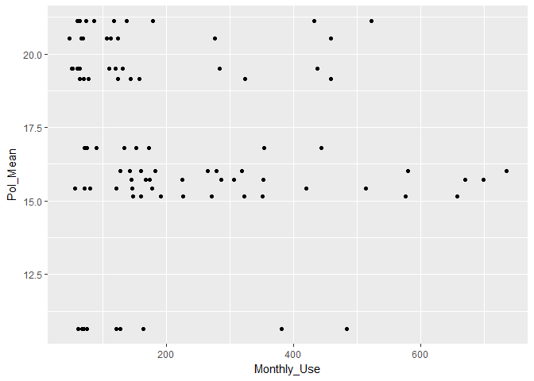
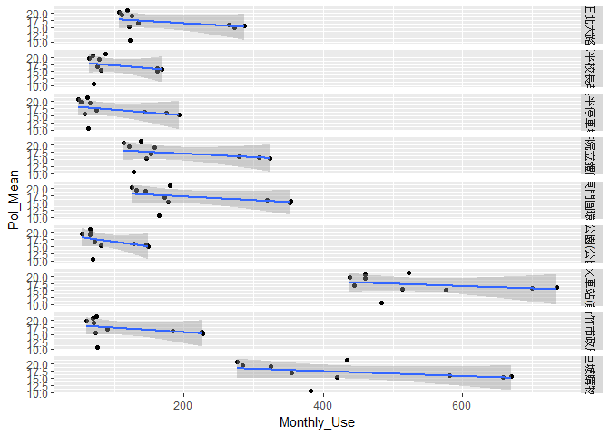
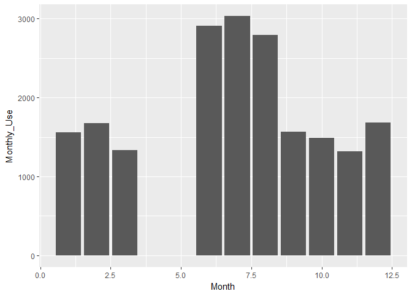
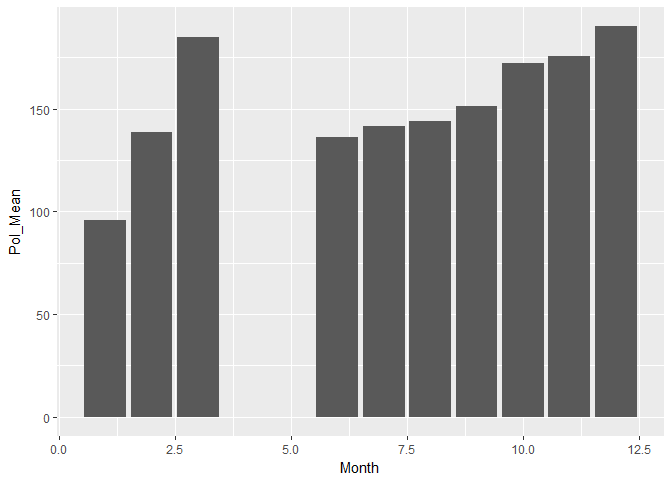

長庚大學 大數據分析方法 期末報告
================

組員姓名：江昭輝
----------------

分析議題背景
------------

分析空氣品質的差異是否會影響新北市民對YouBike的使用量

分析動機
--------

常看到一些空氣品質的報導,想確認一般大眾是否會在意

使用資料
--------

1.「新北市YouBike從105年5月26日<sub>106年3月31日的使用量」(XinBei\_YouBike\_UseData.csv)\\ 2.「環境空氣品質的各種資料\_從104年8月到106年1月」(Environmental\_pollution\_InFo.csv)\\ 3.決定分析105年6月</sub>106年3月 載入使用資料們

``` r
library(readr)
```

    ## Warning: package 'readr' was built under R version 3.3.3

``` r
Environmental_pollution_InFo <- read_csv("C:/CGUIM_BigData_HW6-bigboss/Environmental_pollution_InFo.csv")
```

    ## Parsed with column specification:
    ## cols(
    ##   ItemName = col_character(),
    ##   Category = col_character(),
    ##   Year = col_integer(),
    ##   Month = col_integer(),
    ##   ItemValue = col_character(),
    ##   ItemUnit = col_character()
    ## )

``` r
XinBei_YouBike_UseData <- read_csv("C:/CGUIM_BigData_HW6-bigboss/XinBei_YouBike_UseData.csv", 
    col_names = FALSE, skip = 1)
```

    ## Parsed with column specification:
    ## cols(
    ##   .default = col_integer(),
    ##   X1 = col_character(),
    ##   X3 = col_character(),
    ##   X36 = col_double(),
    ##   X37 = col_double()
    ## )

    ## See spec(...) for full column specifications.

資料處理與清洗
--------------

``` r
library(dplyr)
```

    ## Warning: package 'dplyr' was built under R version 3.3.3

    ## 
    ## Attaching package: 'dplyr'

    ## The following objects are masked from 'package:stats':
    ## 
    ##     filter, lag

    ## The following objects are masked from 'package:base':
    ## 
    ##     intersect, setdiff, setequal, union

``` r
library(datasets)
library(data.table)
```

    ## -------------------------------------------------------------------------

    ## data.table + dplyr code now lives in dtplyr.
    ## Please library(dtplyr)!

    ## -------------------------------------------------------------------------

    ## 
    ## Attaching package: 'data.table'

    ## The following objects are masked from 'package:dplyr':
    ## 
    ##     between, first, last

``` r
library(ggplot2)
```

    ## Warning: package 'ggplot2' was built under R version 3.3.3

``` r
#從「環境空氣品質的各種資料」中抽取所需要的欄位:空氣品質保護
Needed_Environ_Info<-subset(Environmental_pollution_InFo,Category=="空氣品質保護")
#把數值欄位中的"－"取代為0
Needed_Environ_Info$ItemValue<-gsub("－",0,Needed_Environ_Info$ItemValue)
#把YouBike資料不需要的欄位拿掉,留下時間,地點,租借編號,月平均租借量
test<-XinBei_YouBike_UseData
test[4:35]<-NULL
test[5:6]<-NULL
```

探索式資料分析
--------------

``` r
#從「新北市YouBike從105年5月26日~106年3月31日的使用量」找出各租借點的出現次數
DT1<-data.table(test)
DT_XinBei_YouBike_UseData<-DT1[,.N,by=X3]
DT_XinBei_YouBike_UseData[N>=11]
```

    ##                    X3  N
    ## 1:   新竹火車站(前站) 11
    ## 2:           東門圓環 11
    ## 3:         新竹市政府 11
    ## 4: 明志書院立體停車場 11
    ## 5:     辛志平校長故居 11
    ## 6:       中正北大路口 11
    ## 7:         延平停車場 11
    ## 8:   新竹公園(公園路) 11
    ## 9:   遠東巨城購物中心 11

``` r
#把ItemValue轉換成數值型態
DT2<-data.table(Needed_Environ_Info)
DT2$ItemValue<-as.numeric(DT2$ItemValue)
#統計出各種空氣品質數據的月平均值
Monthly_Mean<-group_by(DT2,Month,ItemName)%>%
summarise(MonthlyMean=mean(ItemValue))
#用一個欄位表示各種各種空氣品質數據的平均
Monthly_Mean.group<-group_by(Monthly_Mean,Month)%>%
summarise(Pol_Mean=mean(MonthlyMean))
#合併租借點出現次數=11的租借站資料
Analysis<-DT1[grepl("新竹市政府",X3)]%>%rbind(DT1[grepl("東門圓環",X3)])%>%rbind(DT1[grepl("延平停車場",X3)])%>%rbind(DT1[grepl("中正北大路口",X3)])%>%rbind(DT1[grepl("明志書院立體停車場",X3)])%>%rbind(DT1[grepl("辛志平校長故居",X3)])%>%rbind(DT1[grepl("遠東巨城購物中心",X3)])%>%rbind(DT1[grepl("6101",X2)])%>%rbind(DT1[grepl("6109",X2)])
#把不在分析範圍內的資料刪除
Analysis<-subset(Analysis,X1!="105年5月")
#把月份的欄位轉成數字好方便等等合併Monthly_Mean.group資料表
Analysis$X1<-gsub("105年6月",6,Analysis$X1)
Analysis$X1<-gsub("105年7月",7,Analysis$X1)
Analysis$X1<-gsub("105年8月",8,Analysis$X1)
Analysis$X1<-gsub("105年9月",9,Analysis$X1)
Analysis$X1<-gsub("105年10月",10,Analysis$X1)
Analysis$X1<-gsub("105年11月",11,Analysis$X1)
Analysis$X1<-gsub("105年12月",12,Analysis$X1)
Analysis$X1<-gsub("106年1月",1,Analysis$X1)
Analysis$X1<-gsub("106年2月",2,Analysis$X1)
Analysis$X1<-gsub("106年3月",3,Analysis$X1)
Analysis$X1<-as.numeric(Analysis$X1)
#欄位重新命名+合併
setnames(Analysis,old = c("X1","X2","X3","X36"),new = c("Month","ID","Name","Monthly_Use"))
Combine_Data<-inner_join(Analysis,Monthly_Mean.group,by='Month')
#將月份由小到大排序
Combine_Data_Ordered<-Combine_Data[order(Combine_Data$Month),]
```

期末專題分析規劃
----------------

希望能找出空氣品質越糟糕YouBike租借量會越少的關係

``` r
#畫點圖
ggplot(Combine_Data_Ordered,aes(x=Monthly_Use,y=Pol_Mean))+geom_point()
```



``` r
#畫子集圖
ggplot(Combine_Data_Ordered,aes(x=Monthly_Use,y=Pol_Mean))+geom_point()+facet_grid(Name~.)+geom_smooth(method = "lm")
```



``` r
#畫bar圖
bbb<-Combine_Data_Ordered
bbb$Name<-as.factor(bbb$Name)
#月份與租借量的關係
ggplot()+geom_bar(data = bbb,aes(x=Month,y=Monthly_Use),stat = "identity")
```



``` r
#月份與空汙的關係
ggplot()+geom_bar(data = bbb,aes(x=Month,y=Pol_Mean),stat = "identity")
```


